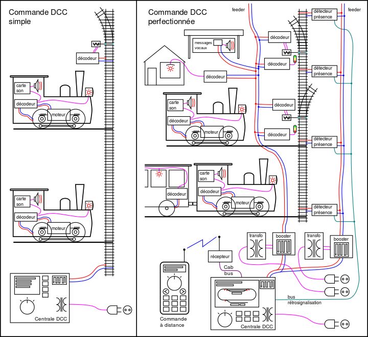
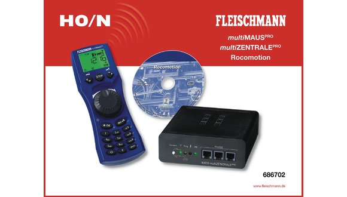
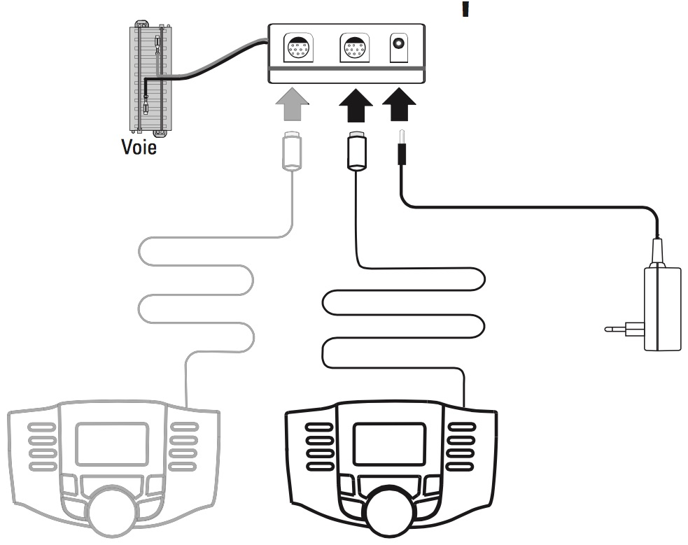
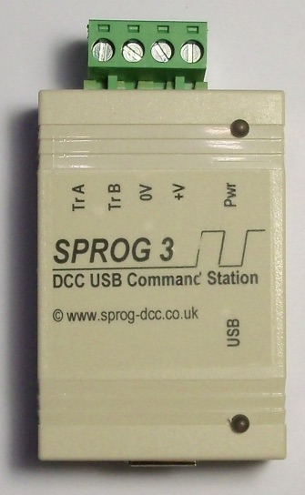
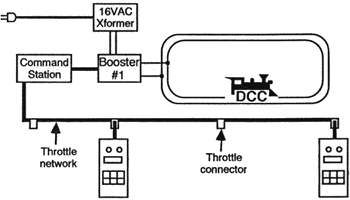
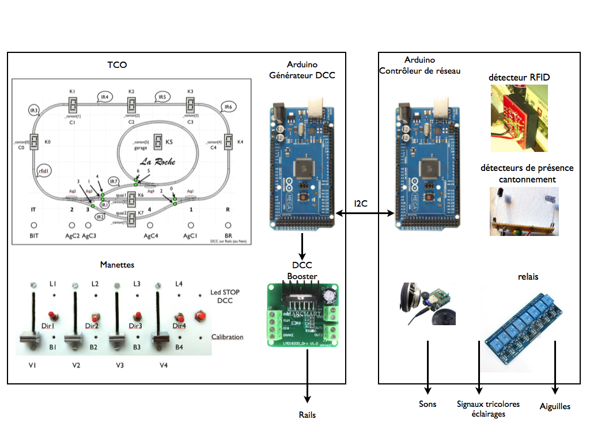
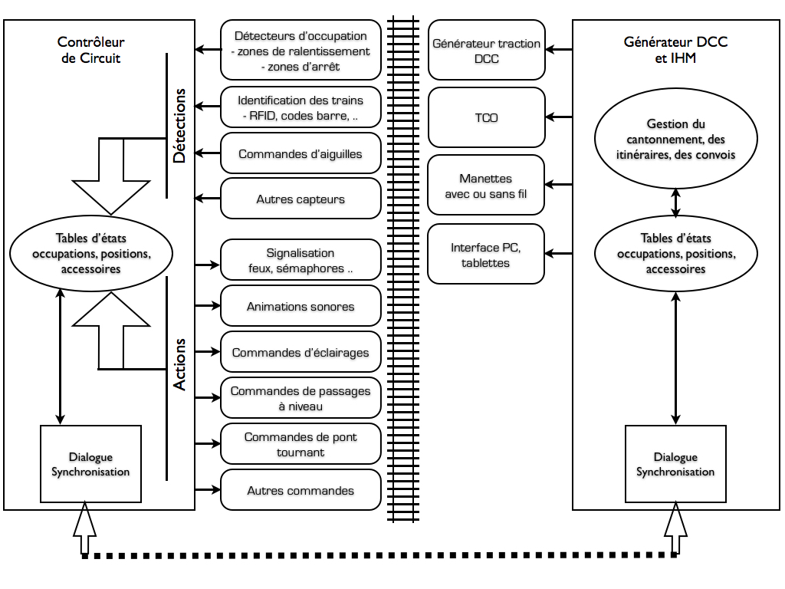

# Projet Locoduino : L'Arduino au coeur d'un système DCC ou analogique

##Introduction
L'Arduino a de multiples raisons de trouver sa place dans les systèmes de pilotage des modèles réduits ferroviaires, qu'ils soient numériques ou analogiques. Mais probablement plus encore pour les systèmes numériques auxquels on va s'atteler pour commencer.

Vous possédez déjà une centrale, quelques modules Arduino vous permettront de la compléter.

Vous n'avez pas encore de centrale, c'est l'occasion rêvée de concevoir votre système sur mesure !

Et tout cela sans vous ruiner, ni vous épuiser dans la programmation.

Le but de cet article est de vous présenter toutes les opportunités d'introduire un ou plusieurs modules à base d'Arduino dans un système digital d'abord, puis analogique (dans un autre article).

Mais il faut d'abord commencer par définir ce qu'est un système de pilotage numérique.

##Définitions
La promesse d'un système de commande numérique (DCC = Digital Command Control) est de permettre de piloter plusieurs trains et accessoires à partir de 2 fils connectés aux rails. Ces 2 fils conduisent à la fois la puissance de traction ET des ordres de pilotage du matériel roulant ET des voies (vitesses, fonctions des locos, commandes d'aiguilles, etc..). Cette simplification extrême est représentée sur la partie à gauche de la figure 1 suivante :

Figure 1 ([source wikipedia](http://fr.wikipedia.org/wiki/Digital_Command_Control))

Elle met en oeuvre une centrale DCC (avec son amplificateur dit "Booster", ici intégré à la centrale) et des décodeurs dans chaque loco et à chaque aiguille.

Cela correspond grosso-modo à un kit de démarrage tel que celui de Fleishmann (Figure 2) :

ou Minitrix (Figure 3) :

On notera que pour piloter les trains et accessoires, il faut de toute façon une interface avec nous, les pilotes humains, que ce soient des manettes (Throttle), des TCOs (tableau de control operationnel, plus généralement dédié aux accessoires tels que les aiguilles et la signalisation), voire des smartphones, tablettes et ordinateurs (avec un logiciel de pilotage). En informatique on appelle cela l'IHM (Interface Homme Machine). 

A l'opposé des manettes ci-dessus, si l'on veut se contenter d'un ordinateur et d'un logiciel de pilotage (RocRail, JMRI, Train Controller, Windigipet, etc..), une simple centrale SPROG (2 ou 3) peut suffir, en connexion USB avec l'ordinateur (Figure 4).

Mais en général, on aura tôt ou tard besoin de plusieurs organes d'IHM qui coexistent. Il en découle la nécessité d'un réseau de raccordement des ces organes de commande. Ils se nomme "Throttle network" sur la figure 5.

### Les réseaux des manettes et accessoires

Figure 5 ([Source dccwiki](http://www.dccwiki.com/DCC_Tutorial_(Basic_System))

Selon les constructeurs de centrales, ces réseaux propriétaires (échappant à la normalisation DCC) se nomment "**Loconet**", proche du protocole Ethernet (Digitrax, propriétaire de LocoNet, Uhlenbrock, Fleischmann) ou "**Xpressnet**", basé sur la norme RS485 (Lenz le créateur, Atlas, Roco, ZTC, CVP, ESU, Hornby), ou **NCE Network** (NCE). La partie droite de la figure 1 montre également un raccordement sans fil d'une manette, les réseaux ci-dessus proposant des liaisons sans fil.

Autant dire qu'il n'y a pas beaucoup de compatibilité entre les éléments d'un constructeur et ceux d'un autre, du coté des centrales et des IHM.

***La norme DCC permet heureusement de libérer les choix des matériels roulants et des accessoires.***

Il reste que cela impose de disposer d'autant de décodeurs que de matériels roulants et d'accessoires ou groupes d'accessoires (une commande DCC peut agir sur 8 actionneurs maximum).

A noter que, si l'on revient sur la partie droite de la figure 1, le réseau d'alimentation et de commande est souvent scindé en 2 parties : une partie pour l'alimentation des locos, via les rails (et souvent aussi via les détecteurs de présence nécessaires au cantonnement) et une partie pour la transmission des commandes aux accessoires (aiguilles, signaux, éclairages, animations sonores, etc..), afin d'éviter les parasites inévitables sur les rails. 

Mais cela ne suffit pas si l'on veut un peu d'automatisme comme le block-système ou le cantonnement, la régulation du trafic, la gestion des signaux et quelques animations lumineuses et sonores : Il faut encore un autre réseau pour la rétrosignalisation.

### Les réseaux de rétrosignalisation
Un troisième réseau est donc nécessaire : celui de la **rétrosignalisation** qui a pour but de remonter à la centrale les événements de circulation (détection de présence ou de passage des trains, entre autres). Propriétaires également, ces réseaux se nomment **Loconet** (Digitrax, Fleishmann, Uhlenbrock, Roco, Zimo), **S88** (ESU, Fleishmann, Tams, Uhlenbrock, Viessmann) ou **RS-feedback** (Lenz).

###Le casse-tête du modéliste ferroviaire
La promesse de compatibilité entre constructeurs est ainsi mise en échec et le coût d'un système de pilotage complet digital peut vite s'avérer très élevée.

En effet, la liste des composants d'un système digital se compose :

- d’une centrale chargée de produire le signal DCC de commande en fonction de la consigne des manettes, de la rétrosignalisation, des automatismes, etc..
- d'une manette pour que l’utilisateur conduise ses trains, et plusieurs quand viennent les copains,
- d’un booster pour fournir le signal DCC de puissance (ex : +/-15V 3 à 5A) à partir du signal de commande fourni par la centrale,
- d’une alimentation pour alimenter le tout en courant électrique,
- d’un décodeur dans chacune des locomotives,
- de décodeurs pour la commande des aiguillages,
- de décodeurs pour la commande de la signalisation,
- de circuits de détection des trains,
- de circuits de gestion des boucles de retournement éventuelles,
- d'une connexion a un ordinateur, tablette, smartphone,
- d'autres décodeurs de commande des feux de signalisation, d'éclairages, d'animations sonores, etc..

Une rapide évaluation du coût d'une configuration moyenne dépasse largement les 1000€ sans compter les rails, les locos, voitures, wagons, et les éléments de décor. Rien que l'électronique! ([source freedcc](http://lib.znate.ru/docs/index-143311.html))

Quel plaisir que celui de voir évoluer plusieurs trains en même temps, certains automatiquement, avec un réalisme surprenant, tout en respectant les règles de sécurité. **Mais comment faire sans se ruiner ?**

##La solution
Notre approche vise à réduire considérablement ce coût en réalisant par nous-même une grande partie des équipements ci-dessus, à partir de modules Arduino et selon une architecture plus simple qui réduit le nombre des éléments matériels, à l'exception des éléments de base conformes à la norme DCC.

Deux cas possibles se présentent :

- La centrale DCC du commerce existe déjà et il faut s'y adapter;
- La centrale DCC n'existe pas et nous sommes libre de concevoir un système complet.

Cette 2 ème approche n'est pas nouvelle : des centrales à monter soi-même (DIY : do it yourself) existent déjà telles que :

- [Free-DCC](http://udelmas.chez.com)
- [Le TCO ultime](http://clprunet.free.fr/TCOultimePresentation/TCOultimePresentation.html)

Ces réalisations permettent bien de "réduire la facture", mais ne concernent pas l'Arduino qui nous interesse ici.

Notre approche, à base d'Arduino et de périphériques largement disponibles dans le commerce à très bas prix, nous parait plus souple et évolutive, parce que modulaire et programmable par tous (le succès de la plateforme Arduino en ateste), dont la plupart des logiciels nécessaires proviennent de l'Open Source (logiciel libre). Comme il existe des multitudes de modules Arduino, diffusés selon le mode du "materiel libre" et de multiples bibliothèques en "logiciel libre", nous verrons qu'il est assez facile de construire sa propre plateforme soi-même, "made in home" : DIY (do it yourself). 

Cette plateforme ne nécessite la réalisation d'aucun circuit imprimé et limite l'usage du fer à souder (on ne peut malheureusement pas échapper à la réalisation des câbles de liaison !). Mais cela sera tout de même un plus pour celui voudra installer en dur son matériel.

Son avantage est l'adaptation aux évolutions. Le faible prix d'un Arduino permet d'en installer plusieurs si l'évolution du réseau le nécessite. Les différents modules communiquent entre eux pour se partager les événements et les fonctions à réaliser.

Un autre avantage est la maitrise du logiciel, donc des fonctionnalités, leur évolutivité, tout ceci s'appuyant sur des logiciels libres largement diffusés et testés que nous avons sélectionné pour éviter les recherches fastidieuses.

Enfin, l'avantage du DIY est que ce modèle peut servir de base pour un réseau analogique.

##Quelle architecture matérielle ?
Deux parties principales sont au coeur de cette architecture :
- le ***générateur de signaux de puissance DCC*** qui orchestre l'ensemble du réseau; en tout cas le matériel roulant en protocole DCC,
- le ***gestionnaire d'accessoires*** qui assure la commande des accessoires et la rétrosignalisation, en symbiose avec le générateur selon des protocoles inter-Arduino plutôt que DCC.

Autour de ces deux parties gravitent un certain nombre d'organes :
- les ***organes d'IHM*** (interface homme-machine) tels que manettes, TCO, tablettes, PC avec différents types de liaisons,
- les ***interfaces d'accessoires*** qui assurent l'interface entre le monde numérique des Arduino et les éléments matériels du réseau, avec des éléments largement disponibles dans le commerce, y compris d'autres Arduino si la solution est plus pratique.

Signalons immédiatement que les interfaces d'accessoires ne seront pas nécessairement conformes à la norme DCC, pour décharger le bus DCC. Des bus de communication entre Arduino et périphériques sont mieux adaptés que le DCC à cette tâche.

En effet, la norme DCC limite le nombre de commandes à 100 - 150 par seconde avec un taux de répétition important.

Il en va de même pour les connexions des organes d'IHM tant que l'on n'utilise pas des produits du commerce.

Mais l'intégration de produits du commerce n'est pas exclue pour ceux qui en disposent, car des circuits d'interface seront envisagés.

###Que commander avec l'IHM ?
Que commande t-on à partir d'un poste de pilotage ?

* les trains (locos et wagons), nécessairement en DCC,
* les aiguilles avec, de préférence, des servos, sans exclure les moteurs d'aiguille du commerce,
* les itinéraires (avec mode automatique ou manuel)
* les feux de circulation ferroviaire, les barrières
* les animation lumineuses : lampadaires, batiments, boutiques, enseignes, feux routiers, panneaux..
* les animation sonores : annonces en gare, etc..
* la configuration des paramètres de l'ensemble
* la programmation des décodeurs (en DCC aussi)

S'il s'agit d'une manette (manette réelle ou smartphone/tablette faisant tourner une application de type "manette"), les commandes se limitent au pilotage des trains (moteur et fonctions).

S'il s'agit d'un TCO, les commandes agiront sur les aiguilles et les animations avec un retour par la rétrosignalisation.

S'il s'agit d'un ordinateur personnel, toutes les commandes ainsi que la rétrosignalisation seront possibles.

###Quelle interfaces et moyens de communication ?
Entre modules, il faut bien s'entendre. Les connexions à réaliser pourront être tout ou partie de cette liste :

* l'interface avec un PC sera en USB ou sans fil en BlueTooth ou WiFi (pour la configuration et pour offrir un bel écran TCO, la compatibilité avec un logiciel du marché n'étant pas recherchée dans un première étape)
* l'interface avec un TCO réel (optionnel, ou plusieurs) avec l'affichage de l'état du réseau (positions des aiguilles et des trains), indicateurs lumineux, boutons de commande manuelle des aiguilles, etc.. Un tel TCO sera avantageusement construit autour d'un Arduino et relié au système par I2C.
* l'interfaces avec une ou plusieurs manettes de commande de train (avec ou sans fil, simple ou sophistiquée - à base de smartphone ou de tablette ou faite sur mesure / DIY)
* l'interfaces de rétrosignalisation (détection de passage/présence des trains, reconnaissance des N°s de trains)
* l'interfaces de commande d'aiguilles
* l'interfaces de commande d'animations lumineuses
* l'interfaces de commande d'animations sonores
* bien-sur cette liste est non exhaustive... tout dépend de la sophistication qui sera voulue. Pour ces dernières interfaces, le moyen de communication va découler de l'architecture qui est décrite.

## Schémas d'architecture
La Figure 6 représente un exemple de système composé de deux parties importantes qui coopèrent pour assurer l'ensemble des animations d'un réseau : la génération du DCC, donc le pilotage des trains, d'un coté et le contrôle du réseau, donc les accessoires de l'autre coté.

Le pilotage des trains requiert la génération du signal DCC. Le comportement des trains sera la résultante des actions du ou des pilotes (manettes) et des retours de signalisation (cantons libres ou occupés).
Le pilotage d'un train nécessitant la connaissance de son adresse DCC, il est indispensable de connaitre sa position et les contraintes liées à cette position (occupation du canton suivant, sémaphore ou contrainte d'itinéraire). 

L'Arduino Générateur DCC recevra donc les commandes des pilotes directement et les informations de positionnement et de cantonnement par l'intermédiaire de l'Arduino Contrôleur de réseau.

Ce dernier devra s'occuper des différents capteurs (capteurs de présence, d'occupation, d'identification, d'incidents, etc..) et des différents actionneurs (aiguilles, signaux, éclairages, sons, etc..).

Tous les deux maintiendront des tableaux de variables communes qui représentent l'état du trafic et permettent au Générateur DCC de piloter les trains.

La répartition des fonctions entre les deux Arduino est représentée sur la figure 7

L'Arduino contrôleur du circuit, à gauche, n'a pas d'interface homme-machine. Il est chargé des détections et des actions :
- détections d'occupation (détection de consommation, barrières infrarouges, etc..) pour les zones de ralentissement et les zones d'arrêt de chaque canton. Ces détections servent à suivre la position des trains;
- identification des trains (capteur RFID, code barre, etc..) pour connaitre les numéros de trains, grâce à laquelle le système pourra piloter les trains par leur adresse DCC;
- autres capteurs (photosensibles, par exemple, pour commander des animations de jour ou de nuit)
- commandes d'aiguilles pour positionner les aiguilles en mode droit ou dévié;
- commande des signaux (feux tricolores);
- animation sonores correspondant aux passages des trains (annonces en gare, bruits divers);
- commandes d'éclairage (éclairage public, éclairage des batiments et boutiques, amimations lumineuses);
- commandes de rotondes et passages à niveau;
- autres commandes selon les contextes.

Toutes le détections et l'état des dispositifs commandés sont consignés dans une table d'états qui est mise à jour à chaque détection et chaque ordre reçu de l'Arduino générateur DCC et IHM.

Ce dernier dispose d'une table similaire qui sert à alimenter le générateur DCC (ralentir un train entrant dans une zone de ralentissement, changer l'état d'une aiguille pour le passage d'un train selon un itinéraire donné, etc..) et à afficher l'état du réseau sur un TCO et/ou sur un écran informatique.
Des manettes et des boutons manipulés par les pilotes transmettent des ordres qui sont acheminés vers l'Arduino contrôleur du circuit qui les exécutera en mettant sa table à jour.

Les deux tables sont synchronisées par un protocole de communication rapide tel que l'I2C.

Rien n'empêche de réaliser l'Arduino contrôleur du circuit et l'Arduino générateur DCC sur des bases Arduino Mega qui offrent un grand nombre d'entrées-sorties. Si ce nombre n'est pas suffisant (cas d'un grand réseau), plusieurs Arduino peuvent être connectés sur ce bus I2C.

##Flexibilité, evolutivité
On tendra vers un système polyvalent. Petit ou grand réseau, il s'agit d'avoir la même architecture pour avoir, si le besoin s'en fait sentir, la possibilité d'agrandir sans changer ce qui a été fait précédemment. Dans cette optique de système polyvalent, si le réseau même petit contient bon nombre de choses, un Arduino seul ne sera pas suffisant.

On notera principalement que la transmission et la traction DCC n'est utilisée QUE pour commander les matériels roulants mais pas les accessoires, ce qui permet de se passer des décodeurs d'accessoires. 

Une technologie de communication est donc nécessaire pour permettre aux Arduinos de coopérer, entre eux d'une part et avec un certain nombre de périphériques d'autre part. Nous en déduisons du fait de sa présence native et d'une documentation bien fournie que celui-ci pourra être de l'I2C.

Mais d'autres technologies de communication seront supportées notamment pour l'interface avec un ordinateur personnel qui supporte principalement l'USB en communications série asynchrone, le Bluetooth ou le Wifi pour le sans fil.

##Compatibilité avec des modules existant
La possibilité de réaliser un système de pilotage 100% à base d'Arduino existe bien réellement, mais, dans la pratique, beucoup de modèlistes voudront réutiliser certains dispositifs qu'ils possèdent déjà.

L'Arduino contrôleur du circuit pourrait, par exemple, générer le signal de rétrosignalisation du protocole S88 pour s'interfacer avec une centrale existante. 

Un décodeur d'accessoires à base d'Arduino peut aussi trouver sa place dans un système comprenant un logiciel de pilotage sur PC et une centrale minimale.

##Quelques exemples de choix d'implémentation grâce aux bibliothèques existantes et fiables
* L'arduino est relié aux rails via un booster et commande les trains par la librairie CmrdArduino.
* Les aiguilles sont commandées via des servos par la librairie servo, mais aussi via des relais pour les moteurs d'aiguillage à impulsion.
* Les Leds des feux de signalisation et des éclairages sont commandées via un étage de puissance puisque l'Arduino ne sera pas à même de fournir l'ampérage nécessaire en général.

##Avertissement et conclusions
De ce projet découlera des programmes qui ne corresponderont pas forcément au réseau que vous possédez, mais ce site vous aidera à les adapter. Les différents articles qui suivent expliqueront la marche à suivre, mais une connaissance minimum de l'environnement de programmation (IDE) et du langage seront nécessaires. Comprendre vous permettra aussi de vous sortir d'un bug intempestif ou récalcitrant.

