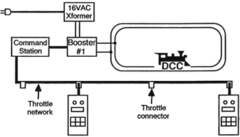
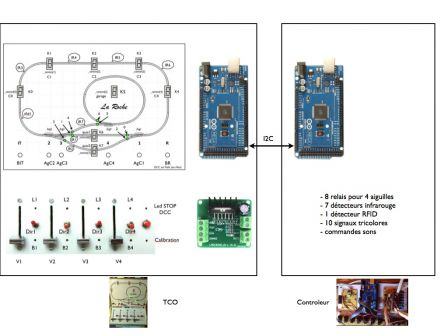

# Projet Locoduino : L'Arduino au coeur d'un système DCC ou analogique

##Introduction
L'Arduino a de multiples raisons de trouver sa place dans les systèmes de pilotage des modèles réduits ferroviaires, qu'ils soient numériques ou analogiques. Mais probablement plus encore pour les systèmes numériques auxquels on va s'atteler pour commencer. 

Vous possédez déjà une centrale, quelques modules Arduino vous permettront de la compléter. 

Vous n'avez pas encore de centrale, c'est l'occasion rêvée de concevoir votre système sur mesure !

Et tout cela sans vous ruiner, ni vous épuiser dans la programmation.

Le but de cet article est de vous présenter toutes les opportunités d'introduire un ou plusieurs modules à base d'Arduino dans un système digital d'abord, puis analogique (dans un autre article).

Mais il faut d'abord commencer par définir ce qu'est un système de pilotage numérique.

##Définitions
La promesse d'un système de commande numérique (DCC = Digital Command Control) est de permettre de piloter plusieurs trains et accessoires à partir de 2 fils connectés aux rails. Ces 2 fils conduisent à la fois la puissance de traction ET des ordres (vitesses, fonctions des locos, commandes d'aiguilles, etc..). Cette simplification extrême est représentée sur la partie à gauche de la figure 1 suivante :

Figure 1 ([source](http://fr.wikipedia.org/wiki/Digital_Command_Control))

Elle met en oeuvre une centrale DCC (avec son amplificateur dit "Booster") et des décodeurs dans chaque locos et pour la commande des aiguilles.

On notera que pour piloter les trains et accessoires, il faut de toute façon une interface avec nous, les pilotes humains, que ce soient des manettes (Throttle), des TCOs (tableau de control operationnel, plus généralement dédié aux accessoires tels que les aiguilles et la signalisation), voire des smartphones, tablettes et ordinateurs. En informatique on appelle cela l'IHM (Interface Homme Machine). Il en découle la nécessité d'un réseau de raccordement des ces organes de commande. Ils se nomme "Throttle network" sur la figure 2.

### Les réseaux des manettes et des accessoires

Figure 2 ([Source](http://www.dccwiki.com/DCC_Tutorial_(Basic_System))

Selon les constructeurs de centrales, ces réseaux propriétaires (échappant à la normalisation DCC) se nomment "**Loconet**", proche du protocole Ethernet (Digitrax, propriétaire de LocoNet, Uhlenbrock, Fleischmann) ou "**Xpressnet**", basé sur la norme RS485 (Lenz le créateur, Atlas, Roco, ZTC, CVP, ESU, Hornby), ou **NCE Network** (NCE). La partie droite de la figure 1 montre également un raccordement sans fil d'une manette, les réseaux ci-dessus proposant des liaisons sans fil.

Si l'on revient sur la partie droite de la figure 1, on constate que le réseau d'alimentation et de commande est souvent scindé en 2 parties : une partie pour l'alimentation des locos, via les rails (et souvent via aussi les détecteurs de présence nécessaires au cantonnement) et une partie pour la transmission des commandes aux accessoires (aiguilles, signaux, éclairages, animations sonores, etc..). Cela impose de disposer d'autant de décodeurs que d'accessoires ou groupes d'accessoires. 

Un troisième réseau est également nécessaire : celui de la **rétrosignalisation** qui a pour but de remonter à la centrale les événements de circulation (détection de présence ou de passage des trains, entre autres). Propriétaires également, ces réseaux se nomment **Loconet** (Digitrax, Fleishmann, Uhlenbrock, Roco, Zimo), **S88** (ESU, Fleishmann, Tams, Uhlenbrock, Viessmann) ou **RS-feedback** (Lenz).

###Le casse-tête du modéliste ferroviaire
La promesse de compatibilité entre constructeurs est ainsi mise en échec et le coût d'un système de pilotage complet digital peut vite s'avérer très élevée.

En effet, la liste des composants d'un système digital se compose :

- d’une centrale chargée de produire le signal DCC de commande en fonction de la consigne des manettes, de la rétrosignalisation, des automatismes, etc..
- d'une manette pour que l’utilisateur conduise ses trains, et plusieurs quand viennent les copains,
- d’un booster pour fournir le signal DCC de puissance (ex : +/-15V 3 à 5A) à partir du signal de commande fourni par la centrale,
- d’une alimentation pour alimenter le tout en courant électrique,
- d’un décodeur dans chacune des locomotives,
- de décodeurs pour la commande des aiguillages,
- de décodeurs pour la commande de la signalisation,
- de circuits de détection des trains,
- de circuits de gestion des boucles de retournement,
- d'une connexion a un ordinateur, tablette, smartphone
- d'autres décodeurs de commande des feux de signalisation, d'éclairages, d'animations sonores, etc..

Une rapide évaluation du coût d'une configuration moyenne dépasse largement les 1000€ sans compter les rails, les locos, voitures, wagons, et les éléments de décor. Rien que l'électronique! ([source](http://lib.znate.ru/docs/index-143311.html))

Mais quel plaisir que celui de voir évoluer plusieurs trains en même temps, certains automatiquement, avec un réalisme surprenant, tout en respectant les règles de sécurité.

##La solution
Notre approche vise à réduire considérablement ce poste de coût en réalisant par nous-même une grande partie des équipements ci-dessus, à partir de modules Arduino et selon une architecture plus simple qui réduit le nombre des éléments matériels, à l'exception des éléments de base conformes à la norme DCC.

Deux cas possibles se présentent :

- La centrale DCC du commerce existe déjà et il faut s'y adapter;
- La centrale DCC n'existe pas et nous sommes libre de concevoir un système complet.

Cette 2 ème approche n'est pas nouvelle : des centrales à monter soi-même (DIY : do it yourself) existent déjà telles que :

- [Free-DCC](http://udelmas.chez.com)
- [Le TCO ultime](http://clprunet.free.fr/TCOultimePresentation/TCOultimePresentation.html)

Ces réalisations permettent bien de "réduire la facture", mais ne concernent pas l'Arduino qui nous interesse ici.

Notre approche, à base d'Arduino et de periphériques largement disponibles dans le commerce à très bas prix, nous parait plus souple et évolutive, parce que modulaire et programmable par tous (le succès de la plateforme Arduino en ateste), dont la plupart des logiciels nécessaires proviennent de l'Open Source (logiciel libre). Comme il existe des multitudes de modules Arduino, diffusés selon le mode du "materiel libre" et de multiples bibliothèques en "logiciel libre", nous verrons qu'il est assez facile de construire sa propre plateforme soi-même, "made in home" : DIY (do it yourself). 

Cette plateforme ne nécessite la réalisation d'aucun circuit imprimé et limite l'usage du fer à souder (on ne peut malheureusement pas échapper à la réalisation des câbles de liaison !). 

Son avantage est l'adaptation aux évolutions. Le faible prix d'un Arduino permet d'en installer plusieurs si l'évolution du réseau le nécessite. Les différents modules communiquent entre eux pour se partager les événements et les fonctions à réaliser.

Un autre avantage est la maitrise du logiciel, donc des fonctionnalités, leur évolutivité, tout ceci s'appuyant sur des logiciels libres largement diffusés et testés que nous avons sélectionné pour éviter les recherches fastidieuses.

Enfin, l'avantage du DIY est que ce modèle peut servir pour un réseau analogique.

##Quelle architecture matérielle ?
Deux parties principales sont au coeur de cette architecture :
- le ***générateur de signaux de puissance DCC*** qui orchestre l'ensemble du réseau
- le ***gestionnaire d'accessoires*** qui assure la commande des accessoires et la rétrosignalisation

Autour de ces deux parties gravitent un certain nombre d'organes :
- les ***organes d'IHM*** (interface homme-machine) tels que manettes, TCO, tablettes, PC avec différents types de liaisons,
- les ***commandes d'accessoires*** qui assurent l'interface entre le monde numérique des Arduino et les éléments matériels du réseau, avec des éléments largement disponibles dans le commerce, y compris d'autres Arduino si la solution est plus pratique.

###Que commander avec l'IHM ?
Que commande t-on à partir du poste de pilotage ?

* les trains (locos et wagons) en DCC,
* les aiguilles avec, de préférence, des servos, sans exclure les moteurs d'aiguille du commerce,
* les itinéraires (avec mode automatique ou manuel)
* les feux de circulation ferroviaire, les barrières
* les animation lumineuses : lampadaires, batiments, boutiques, enseignes, feux routiers, panneaux..
* les animation sonores : annonces en gare, etc..
* la configuration des paramêtres de l'ensemble

###Quelle interfaces et moyens de communication ?
Entre modules, il faut bien s'entendre. Les connexions à réaliser pourront être tout ou partie de cette liste :

* l'interface avec un PC (pour la configuration et pour offrir un bel écran TCO, la compatibilité avec un logiciel du marché n'étant pas recherchée dans un première étape)
* l'interface avec un TCO réel (optionnel, ou plusieurs) avec l'affichage de l'état du réseau (aiguilles et positions des trains), indicateurs lumineux, boutons de commande des aiguilles, etc..
* l'interfaces avec une ou plusieurs manettes de commande de train (avec ou sans fil, simple ou sophistiquée - à base de smartphone ou de tablette ou faite sur mesure / DIY)
* l'interfaces de rétrosignalisation (détection de passage/présence des trains, reconnaissance des N°s de trains)
* l'interfaces de commande d'aiguilles
* l'interfaces de commande d'animations lumineuses
* l'interfaces de commande d'animations sonores
* bien-sur cette liste est non exhaustive...

## Schéma d'architecture
La Figure 3 représente les ingrédients de notre système complet :

Figure 3 - image provisoire

##Réflexion - ***trop vague et précis à la fois - a dispatcher ailleurs***
L'idée d'un système polyvalent prédomine. Dans ce contexte, petit ou grand réseau, il s'agit d'avoir la même architecture pour avoir si le besoin s'en fait sentir la possibilité d'agrandir sans changer ce qui a été fait précédemment. Dans cette optique de système polyvalent, si le réseau même petit contient bon nombre de choses, un Arduino seul ne sera pas suffisant.

Une des conclusions qui peut en ressortir est qu'importe l'interface si TCO ou ordinateur, l'architecture en dessous doit être la même ainsi que le protocole de communication ; protocole de communication qui doit être multipoint dès le début de la conception. Nous en déduisons du fait d'une documentation fournie et d'une prise en charge par l'Arduino que celui-ci sera du i2c.

Si système polyvalent, il faut que le i2c soit reconnu par le PC facilement. Il y a certes certains cartes qui le peuvent comme le Raspberry Pi. Mais il s'agit d'être polyvalent et de pouvoir convenir à plus de monde. Il sera donc nécessaire d'avoir un Arduino convertisseur servant à transmettre les infos de part et d'autre de i2c à la voie série (usb) et vice-versa. Cette option de plus permet de modifier cette connexion filaire en connexion sans fil type bluetooth sans avoir à changer le code. De plus, il sera très facile de basculer d'un TCO virtuel à un TCO physique en échangeant l'Arduino convertisseur à l'Arduino qui a les différents composants du TCO reliés et aussi vice-versa. Il y aura même la possibilité de brancher les deux. Si l'on revient sur le raspberry pi, un des avantages est de mettre en place un hotspot wifi pour pouvoir avoir une interface sur smartphone volante, l'incovénient ainsi que celui-ci de l'ordinateur est de devoir construire une interface.

##Architecture en dessous de l'arduino TCO ou convertisseur - *a détailler/compléter en § séparés*
* L'arduino est relié aux rails via un booster et commande les trains par la librairie cmrdarduino.
* Les aiguilles sont commandées via les servos par la librairie servo et alimentées via une source externe.
* Led commandées via un étage de puissance puisque l'arduino ne sera pas à même de fournir l'ampérage nécessaire si beaucoup d'animations

##Architecture au dessus de l'arduino - *a détailler/compléter en § séparés*
2 solutions s'offrent une sans fil et une fil.
L'idée de s'affranchir de fils offre plus de liberté quant à la position de l'ordinateur mais réduit la fiabilité de la liaison quant que ce soit en bluetooth ou wifi.

##Avertissement - !!! ne pas faire peur !!!
de ce projet découlera des programmes qui ne corresponderont pas au réseau que vous possédez, ce ne sera pas un système tout fait. Les différents articles expliqueront la marche à suivre, mais il faut vous attendre à éditer le code et à en prendre possession.  
